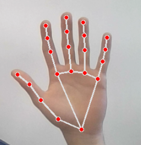
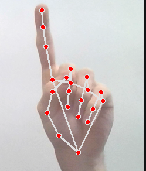
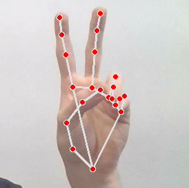
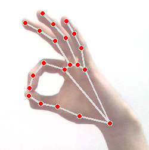

# Projeto de Controle de Sistema com Visão Computacional

 Aplicação de controle de Música com Visão Computacional em Python - Requisitos:

1. Acesso à câmera do sistema 
2. Python 3.12.3
3. CLI's de controle de player e áudio  
4. pip para instalar as dependencias

## Controles:

- Play / Pause : Palma da mão estendida



- Skip : Um Dedo levantado



- Voltar Musica : Dois Dedos levantados



- Ajustar Volume : Pinça (Baixo / Cima) <br> Quanto mais inclinado a pinça maior a sensibilidade. Confira a saída no terminal



## Instalação e Execução 

1. Criar ambiente virtual e ativa-lo

```bash
python3 -m venv env
source env/bin/activate 
```

2. Instalar dependências

```bash
pip install -r requirements.txt
# Instalar clis de player e áudio
sudo apt install pulseaudio-utils playerctl
```

3. Executar o projeto

```bash
python projeto.py # Com interface gráfica
python projeto.py -b # ou --background # Sem interface gráfica
```